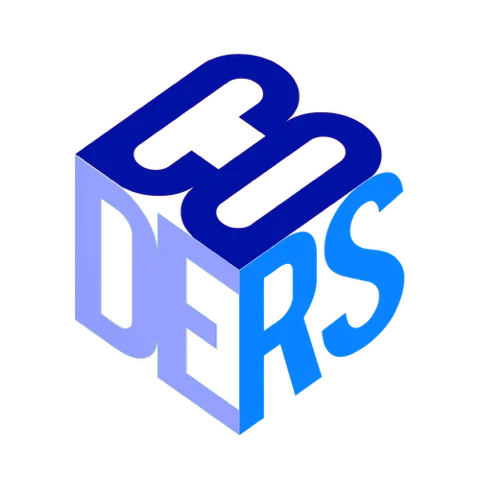

# CODERS Club: Website Project

[![Contribution Guide][img-contribute]][url-contribute]
[![Security Policy][img-security]][url-security]
[![Getting Help][img-help]][url-help]

[![Discord][img-discord]][url-discord]
[![GitHub][img-github]][url-github]

The official website for the CODERS Club at the University of Wisconsin-La Crosse.

## Technology Stack

Our website is built on a modern technology stack. This project is a great opportunity to get hands-on experience with these tools. If you're new to any of them, don't worry—we're here to help you learn!

- **HTML**: Builds the basic structure of the website pages.
- **Tailwind CSS**: A utility-first CSS framework that provides pre-built classes to style elements quickly and consistently.
- **TypeScript**: JavaScript with added features (like types) to help prevent bugs and keep the code organized.
- **Angular**: The main framework holding everything together and making the site dynamic.

> [!NOTE]
> We are currently migrating our styling to Tailwind CSS. Some pages may still use SCSS during this transition period.

## Further Reading & Resources

Here are some of our favorite resources for learning the technologies used in this project:

- [MDN Web Docs](https://developer.mozilla.org/en-US/docs/Web/HTML): The ultimate reference for any web standard (HTML, CSS, JavaScript). When in doubt, start here.
- [freeCodeCamp](https://www.freecodecamp.org/): Offers excellent, free, hands-on tutorials for beginners.
- [Tailwind CSS](https://tailwindcss.com/): The official docs are fantastic and have great examples.
- [Eloquent JavaScript](https://eloquentjavascript.net/): A classic book for truly understanding how JavaScript works.
- [TypeScript Official Docs](https://www.typescriptlang.org/): The best place to learn about TypeScript's features.
- [Angular Official Docs](https://angular.io/docs): Comprehensive guides and tutorials for the Angular framework.

## Contributing

This project is built by and for the students at the University of Wisconsin-La Crosse. We welcome contributions from all UWL students and CODERS Club members!

To get started, please read our [Contribution Guide](CONTRIBUTING.md), which outlines our development workflow, coding standards, and project structure.

## Getting Help

If you encounter issues, have questions, or need assistance with this project, here are several ways to get support:

- For bug reports, feature requests, or specific technical questions related to the codebase, please [open an issue](https://github.com/UWL-CODERS/website/issues).
- Join our [CODERS Club Discord server](https://discord.gg/UGupy2CVVq) for general discussion, quick questions, and community interaction.
- For specific inquiries not suitable for public view, you can reach out to the current Website Development Leader on Discord or by mentioning @muhdfdeen in a GitHub issue.

## Contributors

Thanks to these amazing people who have contributed to this project:

[img-contribute]: https://img.shields.io/badge/Contribution%20Guide-black?style=for-the-badge&logo=data:image/svg+xml;base64,PHN2ZyB4bWxucz0iaHR0cDovL3d3dy53My5vcmcvMjAwMC9zdmciIHdpZHRoPSIyNCIgaGVpZ2h0PSIyNCIgdmlld0JveD0iMCAwIDI0IDI0IiBmaWxsPSJub25lIiBzdHJva2U9IndoaXRlIiBzdHJva2Utd2lkdGg9IjIiIHN0cm9rZS1saW5lY2FwPSJyb3VuZCIgc3Ryb2tlLWxpbmVqb2luPSJyb3VuZCIgY2xhc3M9ImZlYXRoZXIgZmVhdGhlci1jb2RlIj48cG9seWxpbmUgcG9pbnRzPSIxNiAxOCAyMiAxMiAxNiA2Ij48L3BvbHlsaW5lPjxwb2x5bGluZSBwb2ludHM9IjggNiAyIDEyIDggMTgiPjwvcG9seWxpbmU+PC9zdmc+
[url-contribute]: ./CONTRIBUTING.md
[img-security]: https://img.shields.io/badge/Security-black?style=for-the-badge&logo=data:image/svg+xml;base64,PHN2ZyB4bWxucz0iaHR0cDovL3d3dy53My5vcmcvMjAwMC9zdmciIHdpZHRoPSIyNCIgaGVpZ2h0PSIyNCIgdmlld0JveD0iMCAwIDI0IDI0IiBmaWxsPSJub25lIiBzdHJva2U9IndoaXRlIiBzdHJva2Utd2lkdGg9IjIiIHN0cm9rZS1saW5lY2FwPSJyb3VuZCIgc3Ryb2tlLWxpbmVqb2luPSJyb3VuZCIgY2xhc3M9ImZlYXRoZXIgZmVhdGhlci1sb2NrIj48cmVjdCB4PSIzIiB5PSIxMSIgd2lkdGg9IjE4IiBoZWlnaHQ9IjExIiByeD0iMiIgcnk9IjIiPjwvcmVjdD48cGF0aCBkPSJNNyAxMVY3YTUgNSAwIDAgMSAxMCAwdjQiPjwvcGF0aD48L3N2Zz4=
[url-security]: ./SECURITY.md
[img-help]: https://img.shields.io/badge/Getting%20Help-black?style=for-the-badge&logo=data:image/svg+xml;base64,PHN2ZyB4bWxucz0iaHR0cDovL3d3dy53My5vcmcvMjAwMC9zdmciIHdpZHRoPSIyNCIgaGVpZ2h0PSIyNCIgdmlld0JveD0iMCAwIDI0IDI0IiBmaWxsPSJub25lIiBzdHJva2U9IndoaXRlIiBzdHJva2Utd2lkdGg9IjIiIHN0cm9rZS1saW5lY2FwPSJyb3VuZCIgc3Ryb2tlLWxpbmVqb2luPSJyb3VuZCIgY2xhc3M9ImZlYXRoZXIgZmVhdGhlci1oZWxwLWNpcmNsZSI+PGNpcmNsZSBjeD0iMTIiIGN5PSIxMiIgcj0iMTAiPjwvY2lyY2xlPjxwYXRoIGQ9Ik05LjA5IDlhMyAzIDAgMCAxIDUuODMgMWMwIDItMyAzLTMgMyI+PC9wYXRoPjxsaW5lIHgxPSIxMiIgeTE9IjE3IiB4Mj0iMTIuMDEiIHkyPSIxNyI+PC9saW5lPjwvc3ZnPg==
[url-help]: #getting-help
[img-discord]: https://img.shields.io/badge/dynamic/json?url=https%3A%2F%2Fdiscord.com%2Fapi%2Finvites%2FUGupy2CVVq%3Fwith_counts%3Dtrue&query=%24.approximate_member_count&style=for-the-badge&label=Discord&color=5865F2&logoColor=white&labelColor=black&logo=discord
[img-github]: https://img.shields.io/github/stars/UWL-CODERS/website?style=for-the-badge&label=Stars&color=white&logoColor=white&labelColor=black&logo=github
[url-discord]: https://discord.gg/UGupy2CVVq
[url-github]: https://github.com/UWL-CODERS/website
